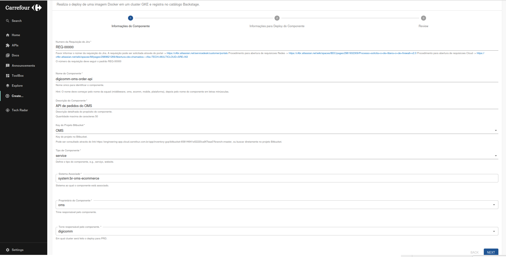

# Guia do Usuário para deploy Aplicações (Kustomize)

## Introdução
Selecione o template "GCP - GKE Deploy Service" para realizar o deploy de uma imagem Docker em um cluster GKE e registrá-la no catálogo Backstage. Este template cria os arquivos de manifesto Kubernetes utilizando o Kustomize.

O template selecionado cria os manifestos necessários para o deploy de um serviço existente em um cluster GKE, seguindo os padrões acme.

## Preencha as Informações do Componente

**Número da Requisição do Jira**: Insira o número da requisição do Jira. A requisição pode ser solicitada através do portal: [Link para Jira](https://acmebr.atlassian.net/servicedesk/customer/portals).  
  - **Exemplo**: `REQ-12345`  

**Nome do Componente**: Nome único para identificar o componente.  
  - Deve começar pelo nome da squad (middleware, oms, ecomm, mobile, plataforma), seguido pelo nome do componente em letras minúsculas.  
  - **Exemplo**: `middleware-api-example`  

**Descrição do Componente**: Descrição detalhada do propósito do componente.  

**Key do Projeto Bitbucket**: Key do projeto no Bitbucket.  
  - Pode ser consultado através deste [Link](https://engineering-app.cloud.acme.com.br/app/inventory-gcp/bitbucket-6581f4641e52220ca9f7baa0?branch=master) ou diretamente no projeto Bitbucket.  

**Tipo de Componente**: Selecione o tipo de componente.  

**Sistema Associado**: Sistema ao qual o componente está associado.    

**Proprietário do Componente**: Time responsável pelo componente.  

**Torre responsável pelo componente**: Cluster onde será feito o deploy para PRD.  

### Informações para Deploy do Componente

**Selecione os ambientes para realizar o Deploy**: Selecione os ambientes (`prd`, `qa`).  
**Centro de Custo**: Selecione qual centro de custo.  
**Kubernetes Namespace**: Nome do namespace Kubernetes. Deve começar com "br-", seguido pelo nome da squad.  
**Porta de Exposição da Aplicação**: Informe a porta de exposição da aplicação. Máximo de 4 dígitos.

### Revise as Informações

## Imagem do Processo

## Fluxo Automatizado

O template realiza automaticamente as seguintes ações:

- Clona o repositório da aplicação do Bitbucket.
- Obtém dados do cluster GKE.
- Obtém o scaffolder da API.
- Adiciona, commita e envia as alterações para o repositório da aplicação.
- Registra a aplicação no catálogo do Backstage.
- Clona o repositório de manifesto global do Bitbucket.
- Obtém o scaffolder do manifesto.
- Atualiza o arquivo de kustomization para a aplicação.

## Links de Saída

    - Link para o repositório no Bitbucket
    - Link para o repositório de manifesto global
    - Link para abrir a aplicação no catálogo do Backstage

---

Este guia cobre os principais passos para utilizar o template "GCP - GKE Deploy Service" no Backstage. Certifique-se de seguir todas as instruções cuidadosamente para garantir que o processo seja executado corretamente.