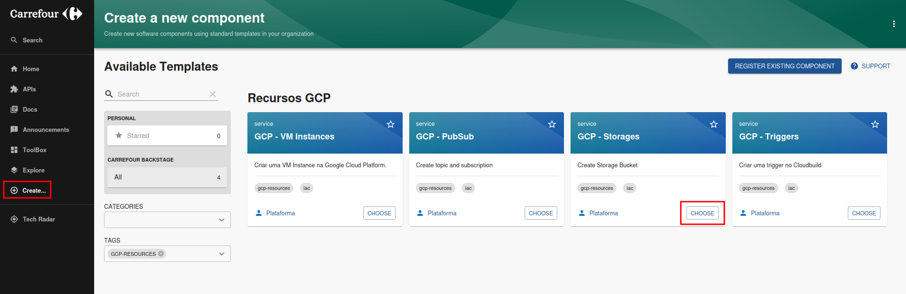

# Guia do Usuário para Recursos GCP

## Introdução
Selecione qual Recurso deseja Criar:

O template "GCP - Storages" cria um novo bucket de armazenamento no GCP seguindo os padrões definidos pela plataforma, incluindo configurações iniciais e políticas da organização.

## Preencha as Informações do Componente

**Projeto do Componente**: Projeto do Componente  
**Nome do Componente**: Nome do Componente  
**Proprietário do Componente**: Proprietário do Componente  
**Número da Requisição do Jira**: Número da Requisição do Jira  
**Overlay do Recurso**: Overlay do recurso
    - **Exemplo**:  
        - qa
        - prd

## Revise as Informações

Revise todas as informações inseridas para garantir que estão corretas antes de prosseguir.

## Fluxo Automatizado

O template realiza automaticamente as seguintes ações:

1. **Configurar Usuário do Git**: Define o usuário do Git para o Backstage.
2. **Determinar Repositório de Manifesto**: Identifica o repositório onde os manifestos de infraestrutura estão armazenados.
3. **Clonar Manifesto Global**: Clona o repositório de manifestos global.
4. **Obter Esqueleto do Recurso**: Busca o template base para o novo recurso.
5. **Atualizar Kustomization Application**: Atualiza o arquivo de configuração `kustomization.yaml` com o novo recurso.
6. **Adicionar, Commitar e Enviar Alterações para o Repositório**: Adiciona as alterações ao repositório, faz o commit e envia para o branch principal.

---

Este guia cobre os principais passos para utilizar o template "GCP - Storages" no Backstage. Certifique-se de seguir todas as instruções cuidadosamente para garantir que o processo seja executado corretamente.
