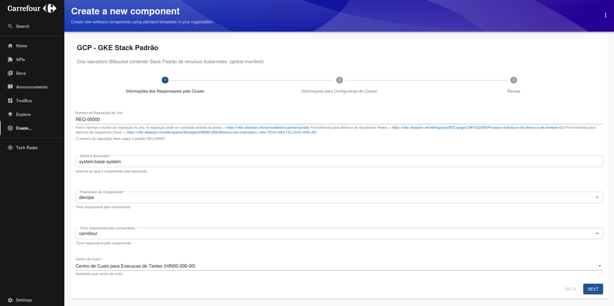
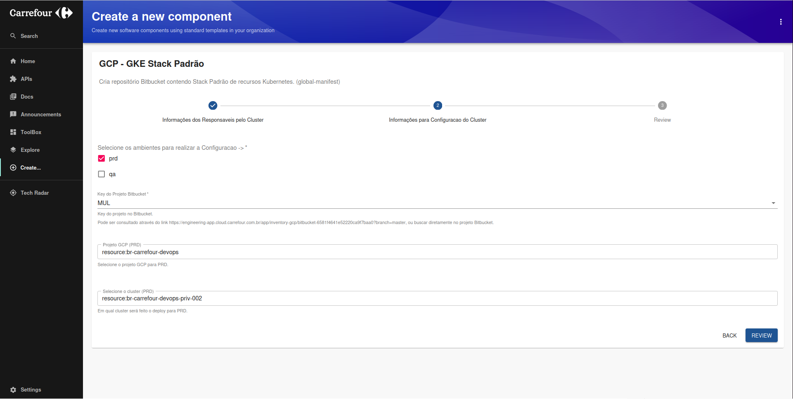

# Guia do Usuário para Configuração de Clusters Kubernetes

## Introdução
Selecione o template para configurar o cluster Kubernetes com a stack padrão e automatizar a configuração do ArgoCD. Este template cria um repositório Bitbucket contendo a stack padrão de recursos Kubernetes.

O template selecionado cria os manifestos necessários para configurar o cluster Kubernetes e automatizar a configuração do ArgoCD, seguindo os padrões acme.

## Preencha as Informações dos Responsáveis pelo Cluster

**Número da Requisição do Jira**: Insira o número da requisição do Jira. A requisição pode ser solicitada através do portal: [Link para Jira](https://acmebr.atlassian.net/servicedesk/customer/portals).  
  - **Exemplo**: `REQ-12345`  

**Sistema Associado**: Sistema ao qual o componente está associado.  

**Proprietário do Componente**: Time responsável pelo componente.  

**Torre responsável pelo componente**: Torre responsável pelo componente.  

**Centro de Custo**: Selecione qual centro de custo.

### Informações para Configuração do Cluster

**Selecione os ambientes para realizar a Configuração**: Selecione os ambientes (`prd`, `qa`).  
**Key do Projeto Bitbucket**: Key do projeto no Bitbucket. Pode ser consultado através deste [Link](https://engineering-app.cloud.acme.com.br/app/inventory-gcp/bitbucket-6581f4641e52220ca9f7baa0?branch=master) ou diretamente no projeto Bitbucket.

### Revise as Informações

## Imagem do Processo

## Fluxo Automatizado

O template realiza automaticamente as seguintes ações:

- Obtém os scaffolds para o manifesto de infraestrutura.
- Obtém os scaffolds para o README e Kustomization.
- Cria o repositório global de manifesto no Bitbucket.
- Clona o repositório de manifesto global C4 Shared.
- Obtém os scaffolds para a configuração do ArgoCD no C4 Shared.
- Obtém os scaffolds para a configuração do Crossplane no C4 Shared.
- Adiciona o cluster ao ArgoCD Shared.
- Adiciona o repositório ao ArgoCD Shared.
- Atualiza o arquivo de kustomization para a aplicação.

## Links de Saída

- Link para repositorio Global Manifest

---

Este guia cobre os principais passos para utilizar o template "GCP - GKE Stack Padrão" no Backstage. Certifique-se de seguir todas as instruções cuidadosamente para garantir que o processo seja executado corretamente.
